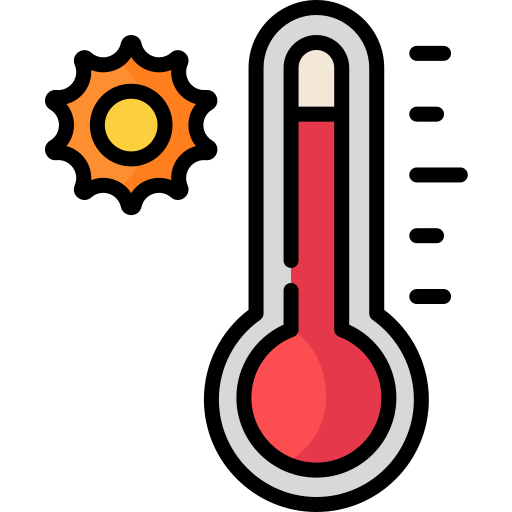
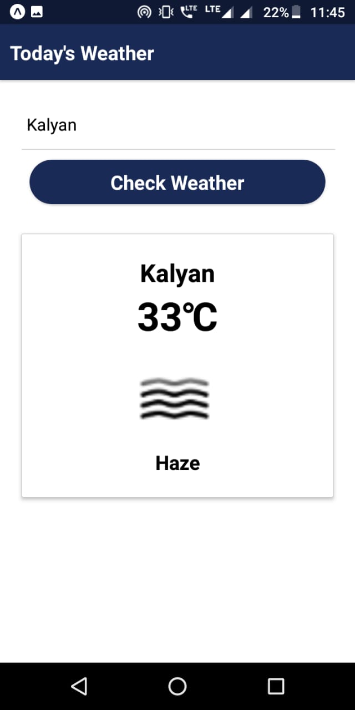

<div align="center">

<h1>Weather App</h1>


+ Today's current weather and temprature is fetched using openweathermap API of provided city
+ Tech Stack
  + React Native
  + openweathermap API




To Build in Your system:
write in your terminal
```sh
git clone https://github.com/joshiadvait8/weather-app.git
cd weather-app
npm install
npm start
```
</div>

-------------------------------------------------------
Icon made by <a href="Freepik.com">Freepik</a> from www.flaticon.com 


